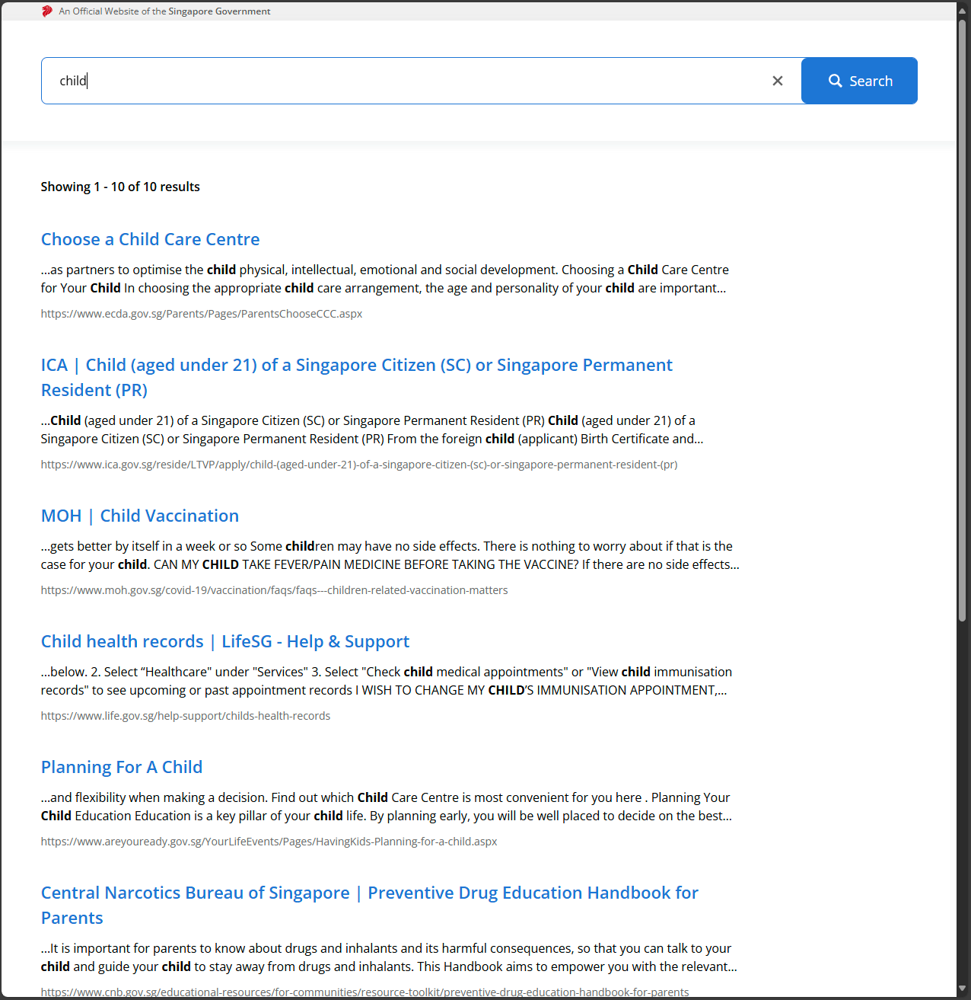
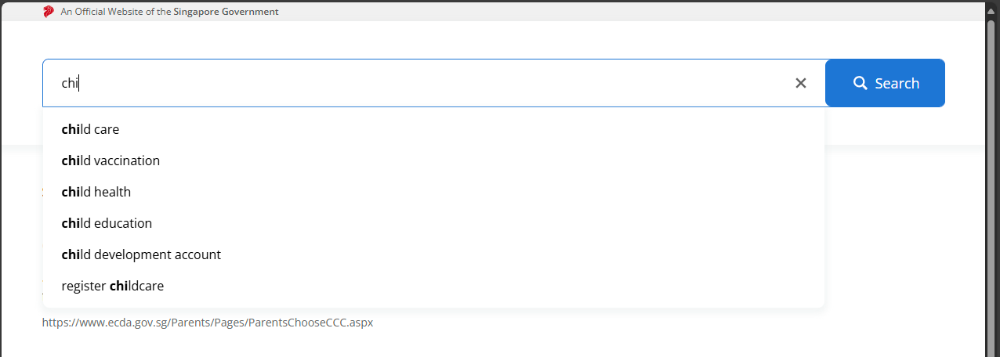

# Overview

This project, 'Searching Website', is a web application designed to provide search function to user and display the results with highlighted words

# Table of contents

- [Overview](#overview)
- [Approach](#approach)
- [Libraries](#libraries)
- [Installation](#installation)
  - [Run the App](#run-the-app)
  - [Tests and Coverage](#tests-and-coverage)

# Approach

In this project, since the API endpoints return static responses, all filtering and search functionalities are handled entirely on the frontend. When users search or apply filters, the client processes the static data fetched from the server by matching it against the search keyword or filter criteria.

- Filter the search results to include only items with titles containing the search term, ignoring case sensitivity.
- Provide search suggestions that contain the search term within the suggestion content, maintaining case sensitivity.

# Libraries

- Typescript: TypeScript is a language for application-scale JavaScript
- React: React is the library for web and native user interfaces.
- Tailwindcss: A utility-first CSS framework for rapidly building custom user interfaces.
- Vite: A build tool for modern web development.
- Vitest: A testing framework for JavaScript and TypeScript.
- Lodash.debounce: A utility function for debouncing functions.

# Installation

To install and run this project on your local machine, follow these steps:

1. Clone the repository

   ```bash
   git clone https://github.com/DrakeGoCoding/web-developer-interview.git
   cd web-developer-interview
   ```

2. Install dependencies

   ```bash
    yarn install
   ```

## Run the App

1. Run command

   ```bash
   yarn dev
   ```

2. Open your browser and go to http://localhost:5173

## Linting and Formatting

```bash
yarn lint
yarn format
```

## Tests and Coverage

```bash
yarn test
yarn coverage
```

## Screenshots

User Story 1: As a user, I want to see results displayed when I search in the search bar



User Story 2: As a user, I want to see suggestions in the search bar


Test Coverage

